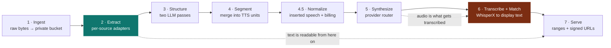
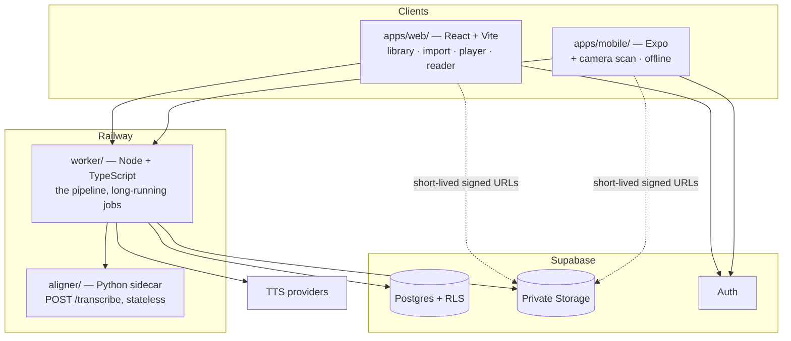

<p align="center">
  
</p>

# audiomax.ai

Turn any document into narrated audio with word-level text↔audio sync.

Six sources — PDF, EPUB, DOCX/TXT, article URL, camera scan, pasted text — become
studio-quality speech with a highlight that tracks the word currently being
spoken. Web (React + Vite) and mobile (Expo), backed by a Node/TypeScript worker,
a Python transcription + word-alignment sidecar (WhisperX), and Supabase.

---

## Status: design phase — no implementation exists yet

**Read this section before anything else.** Phase 0 scaffolding now exists —
three pnpm workspaces, two runnable services with `/health`, a test suite, a
secret scan and CI. **No product feature is implemented**: nothing ingests a
document, synthesizes audio or serves a segment. Use **`pnpm`**, not `npm`; the
workspace is pinned via `packageManager` and `npm install` will not work.

```
pnpm install --frozen-lockfile
pnpm test             # prints the total — worker + apps/web + apps/mobile + aligner
pnpm run secrets      # secret scan
pnpm run doc-check    # the documentation gate
node worker/src/index.ts     # /health on :8080
python aligner/service.py    # /health on :8081
```

> **Use `pnpm test`, not `pnpm -r test`.** `aligner/` is a Python sidecar and
> deliberately **not** a pnpm workspace (`pnpm-workspace.yaml`), so `-r` skips
> it. The root `test` script runs the workspaces *and* the sidecar.
>
> **This block used to state a total, and it was wrong in four consecutive
> rounds** — `# worker 11 · apps/web 5 · apps/mobile 5` (21, beside a sentence
> claiming 66), then 66, then 76, then stale again the moment a peer wrote
> tests. **No guard checks a test count.** The command is the answer; see
> [`CONTRIBUTING.md`](CONTRIBUTING.md) §1 for why the integer was removed rather
> than corrected a fifth time.

What is committed is the working agreement, this README, `CONTRIBUTING.md`,
`CODEOWNERS`, the public documentation in `docs/`, the documentation gate
(`tools/doc-check.mjs`) and the review trail — see the table below.

| What | State |
| --- | --- |
| Implementation code | **None.** Not started. |
| `tools/doc-check.mjs` | Present and running. The documentation consistency gate — bidirectional field coverage, migration coverage, 17 prose-regression guards, and an end-to-end control-chain trace. `node tools/doc-check.mjs` must exit 0 before a commit; `--self-test` mutates the live documents and runs the shipped checks, proving that **the check IDs with a mutation** fire on their own defect. **`--figure-check` is the third mode and the one to reach for while writing:** `--figure-check 'file.json#key.path=value'` verifies a number against a committed artifact by key path and exits 0 or 1, so a figure in prose is checkable in one line instead of by reading JSON. **Twelve check IDs are verified by hand rather than by the harness — eight guards plus four of the five control chains — and the harness names all twelve**, in the line `NOT mutated (12): …` printed by `--self-test`. *(This read *"Eight check IDs and four of the five control chains"*, which sums to the same twelve and reads as eight; the harness calls all twelve check IDs and prints one list. Corrected 2026-08-11 — the settling command is `node tools/doc-check.mjs --self-test`, and it only prints that line on a clean baseline.)* Exits 2 on a fresh clone, because the documents it checks live in the gitignored `resources/`. **Exit 2 is not a pass.** |
| Commits on `main` | The founding documents, the working agreement, the gate tool and **36 audit records** — 33 in Jury's founding-documents series plus Halo's round-34 spike-A review. Count them with `ls resources/audits/`, never from memory. *(This said 33 until 2026-08-11, and so did `[SD-COUNT-AUDITS]`: the guard derived its expected count from filenames matching `founding-documents(-roundN).md`, so **a reviewer-specific record was invisible to the check that exists to keep the trail honest** — and the same constant told seven documents that Halo's round-34 report "was never written" while it sat in the directory being counted. Guard repaired the same day; see `H34-M4b` in `tools/doc-check.mjs`.)* The design itself is **not** in the repository — `resources/specs` and `resources/roadmap` are gitignored — and Jury's most recent *recorded* ruling on it is `PASS WITH FIXES`, **round 33** (`2026-08-08-founding-documents-round33.md`). **The standing verdict is not Jury's:** Halo's **round 35** `FORECLOSES` (`2026-08-10-spike-a-accessibility-round34.md` and `2026-08-11-spike-a-accessibility-round35.md` and `2026-08-08-founding-documents-round36.md`) is newer and carries two Criticals, so the gate is shut. The commit gate governs the file set under review; the trail is committed so it cannot go missing again. |
| `docs/` (public documentation) | **Present** — created in Phase 0. 6 ADRs in [`docs/architecture/`](docs/architecture/) and the [glossary](docs/glossary.md). `docs/help/` (Guide) does not exist yet — **and that is now an owned, dated gap rather than an absence** (`H34-p1`: Guide with Proof · due 2026-08-20, roadmap Phase 2). Every disclosure this design turns on ends as a sentence a blind user hears, and none of them has a draft. |
| `CONTRIBUTING.md`, `CODEOWNERS` | **Present** — how to work in this repo, and which review role owns which path. |
| `assets/` | Present — brand assets. Contents are managed by the design tooling, not by this repo's authors; do not assume a fixed file list. |
| `CLAUDE.md` | Present — the working agreement. Authoritative. |
| `.gitignore` | Present. |
| `resources/specs`, `roadmap`, `research` | Present on disk, **gitignored** — never committed. |
| `resources/audits/` | Present, and **tracked rather than ignored** — the governance trail is versioned and will be in the first commit. |
| Backend design spec | **Draft, under revision.** See [Design status](#design-status-the-spec-is-not-settled). |
| Backend roadmap | v19. Phase 0 open; `git init` and the README are done. |

What a new contributor can do today is **understand the design and the review
gate**, then pick up a Phase 0 item. See [Orientation](#orientation-what-to-read-and-in-what-order).

> **Why the README exists before the code.** The working agreement requires
> documentation to be written in the same change as the behaviour it describes,
> never retrofitted. Root `README.md` is itself a Phase 0 deliverable
> (`resources/roadmap/2026-08-08-backend-roadmap.md`). This file will be rewritten
> — not appended to — the moment there is a local environment to spin up.

---

## Who this is built for

The audience rubric is fixed and every review is graded against it.

| Audience | What they need from the product |
| --- | --- |
| Students | Textbooks and papers as audio; citations and footnotes skippable but recoverable |
| Commuting professionals | A reading backlog cleared hands-free; offline downloads |
| **Blind and low-vision users** | **Reliable TTS they can depend on.** Not a convenience feature — the product |
| Casual readers | Ebooks and long articles, low friction |

**Languages:** English, Spanish, French.

Accessibility is not a workstream that runs alongside the product; it *is* the
product. WCAG 2.2 AA is a floor, not a target, and **Halo** (the accessibility
auditor) signs off on any surface that ships.

---

## How it is meant to work

### The pipeline

Eight stages. Each hands off through the database, so any stage can be retried
independently.



| # | Stage | Does | Emits |
| --- | --- | --- | --- |
| 1 | **Ingest** | Persists raw bytes to a private bucket, creates the document row | `documents` row |
| 2 | **Extract** | Per-source adapters normalise everything to one `Block[]` shape | `blocks` |
| 3 | **Structure** | Pass A: chapters, per-block language, skip candidacy. Pass B: speaker attribution | `chapters`, block flags |
| 4 | **Segment** | Merges non-skipped blocks into TTS units on sentence boundaries | `segments` |
| **4.5** | **Normalize** | Produces inserted speech (table preambles, sentinels) and the **billing** estimate of what will be spoken. It no longer places highlights (`R14-A1`) | inserted text, quote basis |
| 5 | **Synthesize** | Routes each segment to a TTS provider by language, voice, and clone status | `segment_renditions` |
| 6 | **Transcribe + Match** | WhisperX transcribes the audio we generated, returning word-level timestamps; the match step maps observed words onto display-text offsets under a monotonicity rule and a drift bound | word timings, `asr_conf`, `match_conf` |
| 7 | **Serve** | Segment ranges with state, short-lived signed URLs, word timings | API responses |

**Stage 6 is why word-level sync works.** Transcription knows what was *said*;
the page shows something different. The match step connects them, and it is the
component the whole feature rests on — which is why it carries explicit
invariants rather than a confidence score alone. A highlight that lands on the
wrong word looks exactly like one that lands on the right word.

### Three decisions that shape everything

**The segment is the universal unit** — of work, billing, caching, retry,
playback, and sync. Roughly 1,000 characters, roughly 60 seconds of audio. One
choice resolves alignment accuracy (short clips align well and in parallel),
billing precision (the spoken-character count, produced at normalization, is
what the provider bills), lazy generation
(a queue walk over ordinals), retry granularity (a failure costs one segment, not
one book), and offline download ("fetch segments N..M").

**Text before audio.** Extraction finishes in seconds; synthesis takes minutes to
hours. Reading must never wait on TTS — the dashed edge in the diagram above is a
hard requirement, not an optimisation.

**Observe what was spoken; do not predict it** (`R14-A1`, spec §6.1). Earlier
revisions said *"forced alignment, not ASR"*, on the reasoning that we know what
text we sent. We know what we **sent**; we do not know what was **said** — every
TTS provider normalizes internally (`Dr.` → "doctor", `1984` → "nineteen
eighty-four") and whether any of them can be told not to was an open question for
thirteen review rounds. So we stopped asking: we **transcribe the audio we
generated** and read the spoken form off the result. Provider normalization
becomes something we observe rather than something we must predict or negotiate.

Transcription runs on our own WhisperX sidecar, not a per-minute vendor —
Hypereal's $0.01/min is $5.40 for a 9-hour book, four times the synthesis it
would be timing.

For a user tracking their place visually, a highlight on the wrong word is a
correctness bug, not a glitch. Two failure modes, handled differently:

- **A transcribed word that matches nothing on the page** — recognition invented
  it. Excluded from the highlight map and recorded, never silently placed.
- **A transcribed word that matches the *wrong* place** — the dangerous one,
  because it looks correct. Guarded by a monotonicity rule and a drift bound over
  display offsets, and by `match_conf` — *"we know where this goes on the page"*
  — which is a **different number** from `asr_conf`, *"the engine was sure it
  heard this."* Highlighting keys on `match_conf`.

**Two degradation states, and a client must tell them apart** (H17-C2). They are
not interchangeable, and the message catalogue spends two extra keys and eight
extra strings letting a user distinguish them:

- **`degraded`** — partial coverage. Timings exist; some runs are below
  `match_conf_threshold`. The client **highlights the confident spans and skips
  the rest**, while audio plays normally.
- **`unavailable`** — no usable mapping at all. **Highlighting is off** for the
  segment; audio still plays.

The per-word decision keys on `match_conf`; the segment-level `degraded` /
`unavailable` decision keys on `align_conf_threshold`. Neither ever falls back to
estimated timings — a highlight on the wrong word is a correctness bug, and a
guessed one is indistinguishable from a real one.

### Topology



**Why one Python service in an otherwise TypeScript stack.** Transcription and word alignment have
no credible Node implementation. This is the single exception. The sidecar
exposes one endpoint and holds no state, so the seam is narrow — and the worker
codes against an `Aligner` interface, so the backend is swappable without
touching the pipeline.

---

## Repository layout

Only the directories marked `present` exist today. Everything else is the planned
shape, established in Phase 0.

**`present` means present in a CLONE, which is not the same as present on the
authoring machine (J29-p1).** `resources/` was marked `present`, and the claim is
false for everyone who clones this repository: `.gitignore` excludes the
directory's *contents* and then re-admits `resources/audits/`, so a clone gets the
audit trail and nothing else. The specs, the roadmap and the research exist only
on the machine that wrote them. That is deliberate — see the table below — but a
layout diagram that says `present` is telling a newcomer they will find files
they will not find.

```
audioMax/
├── apps/web/               React + Vite — library, import, player, reader   ── present
├── apps/mobile/       Expo React Native — + camera scan, offline       ── present
├── worker/            Node/TS on Railway — the pipeline                ── present
├── aligner/           Python sidecar — WhisperX transcribe + match     ── present
├── supabase/          Migrations, RLS policies, thin edge functions    ── present
├── docs/              Public technical documentation (Scribe)          ── present
│   ├── architecture/  ADRs — the 6 decisions and why                ── present
│   ├── glossary.md    The vocabulary you cannot infer                  ── present
│   └── help/          Public user documentation (Guide)                ── planned
├── tools/             doc-check.mjs — the documentation consistency gate ── present
├── assets/            Brand assets (managed by design tooling)         ── present
├── resources/         Internal working documents                       ── SEE BELOW
│   ├── specs/ roadmap/ research/                                       ── GITIGNORED — never in a clone
│   └── audits/        Jury verdicts                                    ── COMMITTED — the only part you get
├── CLAUDE.md          Working agreement — authoritative                ── present
├── CONTRIBUTING.md    How to work in this repo, and both gates         ── present
├── CODEOWNERS         Path → review role (advisory; see the header)    ── present
└── README.md          This file                                        ── present
```

Root build is a no-op; each service builds independently. Model weights for the
aligner are fetched at build time and never committed — ignored as
**`/aligner/models/`**, deliberately anchored. A bare `models/` pattern would
match `worker/src/models/` at any depth and silently swallow source files.

---

## The commit gate — read this before you write anything

> **No commit. No push. Not code, not config, not markdown. Nothing.**
>
> Every commit MUST be preceded by a review from **Jury**, the Studio Zero audit
> orchestrator. This is not advisory and there is no override.

You are meant to learn this here, not by having a commit rejected.

**`CLAUDE.md` is the single source of truth for this gate.** The table below
mirrors it; if they ever diverge, `CLAUDE.md` wins.

| Jury verdict | Condition | Commit |
| --- | --- | --- |
| `PASS` | Zero open Blocker, Critical, or Major | **Permitted** |
| `PASS WITH FIXES` | Zero open Blocker or Critical. Majors open, each with a named owner and a date | **Permitted** |
| `FAIL` | Any open Blocker or Critical | **Blocked** |

Minor and Polish findings never block a commit. They are tracked and fixed when
convenient, per Jury's own rubric.

A `FAIL` is not negotiable — rework and re-audit. *"I'll fix it in the next
commit"* is explicitly rejected by Jury's rules.

### Running the gate

Spawn a subagent whose system context is the full contents of
`studio-zero/agents/audit/jury.md`, and hand it four things:

1. **The file set under review** — paths, not summaries.
2. **The audience rubric** — Jury refuses to audit without one. For audiomax:
   students, commuting professionals, blind / low-vision users relying on TTS,
   and casual readers, across `en` / `es` / `fr`.
3. **The relevant spec** from `resources/specs/`.
4. **The prior audit report**, if one exists, so findings are resolved by ID.

*(This listed three and omitted the fourth, while `CLAUDE.md` and
`CONTRIBUTING.md` both listed four. Dropping the prior report is not a cosmetic
omission: it is the input that makes "resolve each finding by ID — never
silence" possible at all.)*

Jury returns a **Verdict**, a severity-sorted **Punch List** with owners, and a
**Scorecard**. Every report is stored under `resources/audits/<date>-<subject>.md`
— **including passes.** Silent passes are forbidden.

### Rules inherited from Jury

- **Evidence or it didn't happen.** Findings cite a **quoted string**, a
  capture, or tool output. Never an opinion — and, since `J31-M2`, **never a
  bare line number**: a quoted string survives a reflow and can be re-found with
  `grep -F`, while a line number is only ever true for the version of the file
  that no longer exists. Cite the path and quote the text; if a line number
  helps a reader, it rides *behind* the quotation, never instead of it.
- **Re-audit, don't trust.** Self-attested fixes do not close findings. Since a
  re-spawned agent is not literally the originating reviewer, **artifact
  continuity substitutes**: every finding carries a stable ID, reports are
  committed and diffable, and a re-audit resolves each ID explicitly
  (`fixed` / `open` / `disputed` — never silence) by **re-running the original
  verification command**, not by accepting a claim.
- **Reviewers get read-only tools.** Jury's "auditors do not edit" is enforced
  by tool scope, not by instructions.
- **Auditors do not edit code.** Jury flags; we implement.

### Specialist reviewers

Jury synthesises; specialists find. Each phase of the roadmap names its
reviewers. The ones this project leans on most:

| Concern | Agent | Persona |
| --- | --- | --- |
| Commit gate, audit synthesis | **Jury** | `audit/jury.md` |
| Accessibility **audit** (WCAG 2.2 AA) | **Halo** | `audit/halo.md` |
| Accessibility **engineering** — Halo audits it, **Access builds it** | **Access** | `frontend/access.md` |
| Frontend performance | **Prism** | `frontend/prism.md` |
| User-facing copy | **Proof** | `audit/proof.md` |
| Backend architecture | **Forge** | `backend/forge.md` |
| API contracts | **Nexus** | `backend/nexus.md` |
| Job queues / pipeline | **Queue** | `backend/queue.md` |
| Secrets, keys, RLS | **Vault** | `backend/vault.md` |
| Schema design | **Atlas** | `data/atlas.md` |
| Security | **Shield** / **Cipher** | `security/` |
| AI eval, cost-per-interaction | **Oracle** | `ai/oracle.md` |
| i18n (`en`/`es`/`fr`) | **Tongue** / **Locale** | `platform/` |
| Test strategy | **Probe** | `quality/probe.md` |

Personas live at `C:\Users\Administrator\studio-zero\agents\<layer>\<name>.md`.
Before proposing any tool, framework, or dependency, consult
`studio-zero/CAPABILITIES.md` — it is the source of truth for what this host can
actually run.

---

## Constraints that bind engineering

These are not preferences. A change that violates one does not pass the gate.

| # | Constraint | Consequence if broken |
| --- | --- | --- |
| 1 | **Accessibility is the product.** WCAG 2.2 AA is a floor. | A primary audience cannot use the product at all. |
| 2 | **No fallback launch.** A primary path never depends on a fallback. Degraded paths are emergency-only and must be *visible* when they engage. | A silently wrong word-sync is worse than a visibly absent one. |
| 3 | **Text before audio.** Extracted text is served the moment parsing finishes. | Reading waits hours on synthesis. |
| 4 | **Credits are characters** (1 credit = 1,000 characters synthesised). Providers bill **spoken** characters — counted after normalization, since `1984` is four characters and twenty spoken — and every render is preflighted with an exact quote before a single character reaches a provider. | Surprise debits. Partial renders. |
| 5 | **Provider keys never leave the worker.** Clients get short-lived signed URLs. RLS on every table carrying user data — by `user_id` where the column exists, by join through `documents` otherwise. The exemption is a **class, not a name** (H26-C3): a table is exempt when it carries no user data at all, which today is **two** tables — `voices` and `voice_langs` (spec §7.1a). URL fetching is egress-controlled. | Key exfiltration; cross-tenant reads; SSRF. |
| 6 | **Users can delete their data.** Every document and account has a real erasure path that cascades to storage. | A DMCA takedown you cannot honour. Legal liability, not backlog. |
| 7 | **Users are told where their documents go.** A subprocessor list is maintained and disclosed — **TTS is two vendors — Fish Audio `s2-pro` and Lemonfox**; text additionally reaches an LLM via **OpenRouter**; generated audio also reaches our own first-party transcription sidecar. The Gemini/Google TTS path was removed with `ht` ([ADR-0005](docs/architecture/0005-haitian-creole-is-removed-from-scope.md)); **the LLM's model host is not yet named and must be before ingest ships** — see CLAUDE.md constraint 7. | Undisclosed processing of medical, legal, and unpublished material. |

**A legal gate blocks all ingest.** Roadmap Phase 0.5 — DMCA agent registration,
takedown endpoint, repeat-infringer policy, ToS/AUP, retention policy,
subprocessor list — must clear before any upload endpoint ships. The product's
core loop creates and stores a derivative work from a copyrighted upload; this is
the item most likely to end the project.

Two of these have teeth in the test strategy. **A false skip — dropping real
content from the narration — is a Blocker**, because it is silent data loss for a
user who cannot see the page. A false keep (reading an extra footnote) is Minor.
The asymmetry is deliberate.

---

## Design status: the spec is not settled

**The two most recent recorded verdicts come from different reviewers and do not
say the same thing.**

- **Jury — round 33, `PASS WITH FIXES`**
  (`resources/audits/2026-08-08-founding-documents-round33.md`): 0 Blocker ·
  0 Critical · 4 Major · 3 Minor · 1 Polish. A commit is permitted; four Majors
  are open, each with a named owner and a date.
- **Halo — round 35, `FORECLOSES`**
  (`resources/audits/2026-08-10-spike-a-accessibility-round34.md`): 0 Blocker ·
  **2 Critical** · 6 Major · 4 Minor · 1 Polish. **Both Criticals block a
  commit.** This is the *standing* verdict and it is **newer** than Jury's, so
  the gate is shut until both are closed and re-audited. Halo cannot issue `PASS`
  before implementation and has not.

Round 32 also returned `PASS WITH FIXES` (0 Blocker · 0 Critical · 5 Major), as
did rounds 18, 19, 25, 28, 30 and 31; the `FAIL`s of rounds 17, 22, 27 and 29 are
superseded. Read `resources/audits/` for ground truth.

*(**`H34-M4`, corrected 2026-08-11 — the EIGHTH recurrence.** This block named
**round 31** for Jury and **round 26** for Halo while rounds 32 and 33 were
committed and Halo's round 35 was on disk. The paragraph below documents the same
defect seven times and announces the durable fix — *"none of the three may state
a verdict without naming the round file"* — **which was obeyed here, with a stale
round named.** A rule that survives being obeyed is not the fix. **Recommended
instead, and referred because `tools/` is not Scribe's:** a `doc-check` guard
that resolves the newest `resources/audits/*.md` per reviewer from the index and
fails any `round <N>` verdict claim in `README.md` or
`docs/architecture/README.md` that does not name it. Every previous remedy asked
an author to remember; this one asks `git ls-files`. **Owner: Forge · due
2026-08-13.**)*

*(Corrected 2026-08-10. This paragraph read *"the most recent recorded verdicts
are a Halo `FORECLOSES` and a Jury `FAIL` … Jury round 27: 0 Blocker · 2
Critical · 9 Major"* — **four Jury rounds out of date**, and stating a `FAIL`
while the record on disk says `PASS WITH FIXES`. The same claim lives in three
places — this paragraph, the `Commits on main` row above, and
`docs/architecture/README.md` — and all three carried a **different** stale
round. This is `J24-M3`/`J26-C1` for the seventh time; the durable fix is that
none of the three may state a verdict without naming the round file, so a reader
can check it in one command.)*

*(J26-C1, the **sixth** recurrence of this defect: the citation LINK was advanced
to round 26 and the PROSE beside it was not, so the sentence claimed a pass while
linking to the document that forecloses. Read `resources/audits/` for ground
truth — it is committed for exactly this reason.)*

*(J24-M3: this paragraph carried **round 17's** counts under a **round-22** link
while `docs/architecture/README.md`, in the same commit, correctly recorded round
17 as superseded — two committed documents contradicting each other on governance
state. Read `resources/audits/` for ground truth; it is committed for that reason.)*

What that means for you:

- The **architecture and the principles above are the current design intent** —
  segments as the universal unit, text before audio, observation over prediction,
  visible degradation. These are what the revision is being built on.
- The **specifics are not final.** Do not treat the spec's schema columns, status
  enums, thresholds, size limits, credit ratios, or cost figures as settled, and
  do not quote them as decided. They are draft inputs to a revision, and the
  numbers in particular were derived from a rate card the spec itself flags as
  materially stale.
- **Nothing in the spec has passed the gate.** No part of it is implementable as
  written until a revision returns `PASS`.

### Known open questions

Carried in the spec and not yet closed:

All **open** rows are Phase 0 spikes, and nothing downstream is built until they
return. Struck-through rows are closed; they are kept so a reader can see what was
asked and how it was answered. **SPIKE A is now the only one gating word sync.**

| Question | Why it matters |
| --- | --- |
| **Which transcription + word-alignment engine (WhisperX or equivalent), and does it cover `en` / `es` / `fr`?** | **Highest risk in the design**, and now the only Phase 0 spike gating word sync. **`en` and `fr` are measured. `es` IS NOT, and this cell said otherwise for nine days** (`H34-M1`, corrected 2026-08-11). It read *"Coverage for `en`/`es`/`fr` is now measured, not uncertain"* — an enumeration that names Spanish and is false of it. **`asr_coverage_ceiling` exists on 11 committed clip rows: 9 `fr`, 2 `en`, ZERO `es`** (`aligner/spike-a/out/`; the round adds two more `en` rows and no `es`). **Spanish's largest bar figure is `matched_within_drift_pct` = 68.2 on 22 display words and 11.66 s** (`spike-a-results.json#[lang=es]`, `passes_matched_bar: false`) — there is no chapter-length Spanish arm at all, and the two languages that *were* measured came back with **opposite blockers**, so nothing known predicts the third. `es-para.wav` — **222 display words, 74.93 s** — **exists, was synthesized and was transcribed** (`spike-a-groundtruth.json`, `match_rate_pct` 98.2); the marginal cost of a Spanish ceiling is **one decode**. *(Owner: Forge · due 2026-08-13.)* |
| ~~**Can provider text-normalization be disabled?**~~ | **RETIRED (`R14-A1`).** We transcribe the audio we generated, so provider normalization is observed rather than predicted and nothing depends on the answer. |
| **Is transcription accurate enough per language?** | **NO LANGUAGE HAS A MEASURED END-TO-END PASS, INCLUDING ENGLISH.** <br><br>**⚠ READ THIS FIRST — `aligner/spike-a/out/spike-a-english.json` IS STALE, and everything below quoting it by value is the PRE-FOLD figure** *(2026-08-11)*. Forge shipped the en-GB↔en-US orthography fold (`worker/src/normalize/orthography.ts`) that the probe below predicted. **The committed English file was measured before it existed and has NOT been re-run**, so it still says **90.0 / 98.0 / 25 absent**. Re-running it would emit **90.9 / 99.1 / 11 absent**. Those three current figures are in a **different** artifact — `aligner/spike-a/out/spike-a-english-drift.json` — and none of them is written into `spike-a-english.json` by this change, because moving a committed artifact is a measurement act and not a documentation one. **Quote the old file as *before the fold* and the new one as *current*; never mix them.** What the current run says, every figure checkable by key with `node tools/doc-check.mjs --figure-check`: <br>• **the fold landed and hit its pre-registered prediction exactly** — `verdict.orthography_fold_delta_pp` **+0.9**, and `orthography_fold_predicted_ceiling_pct` **99.1** = `orthography_fold_observed_ceiling_pct` **99.1**, predicted absent **11** = observed absent **11**, `orthography_fold_matches_its_prediction: true`; <br>• **English still fails, and by less than a fold's worth of margin** — `verdict.chapter_best_measured_pct` **92.2** against 95, `clears_bar_with_fa_refinement: false`, `remaining_gap_to_bar_pp` **2.8**; <br>• **THE CONSTANT-OFFSET HYPOTHESIS IS DEAD** — `verdict.constant_offset_recoverable_pp` **0.0**. The whole −250…+250 ms shift curve moves the figure by **0.0 pp**, because §6.1's drift is a *local* residual between a token and its own two neighbours and a uniform shift moves all three together. **The `+90 ms` English calibration and the `−80/−120 ms` attention-derived leads that three artifacts point at cannot buy one token, in any language.** <br>• **forced-alignment re-timing is not the answer either** — `arm_d_fa_refined` gives **+1.3 pp** on the chapter clip and **−5.0 pp** on the paragraph clip. **Opposite signs, n = 2**, and the stage costs 91.6% of the ASR stage again. Nothing here justifies building an FA sidecar. <br>• **what is left is PROSODY, and it is a property of the bar's own definition, not of the decoder** — interior words **96.1%** in-bound against boundary words at **63.8%**; silence over 150 ms present in **79.4%** of failing tokens against **20.6%** of passing ones. `worker/src/normalize/contract.ts` argues that scoring against *local* neighbours avoids charging a sentence-boundary pause as drift; **the measurement falsifies that.** Forge deliberately did not tune it (`H17-C3` — the bound may not be moved to make a measurement pass). **Reopening §6.1's drift predicate is an OPEN OWNER DECISION and the only route to 95 anyone has identified.** <br><br>*(The verdict is unchanged and is not softened. Its **evidence** and its **attribution** are both replaced: until 2026-08-10 this sentence rested on a **~12-second, 24-word** English fixture, and it borrowed French's reason. English now has a chapter-length measurement. **It still fails — for a different reason, and with the bar reachable.**)* <br><br>**ENGLISH IS DRIFT-BOUND. FRENCH IS ASR-BOUND. SAME BAR, OPPOSITE BLOCKER — and it must be stated per language from here on.** In `aligner/spike-a/out/spike-a-english.json`, on **1246** display words and **453.73** s of audio: end to end, `clips[].matched_within_drift_pct` is **90.0** (CI95 **88.3**–**91.6**), `passes_matched_bar: false` — **English fails.** But `clips[].asr_coverage_ceiling.coverage_ceiling_pct_any_matcher` is **98.0**, with `coverage_ceiling_clears_bar: true`: the recogniser emits 98.0% of display tokens in a form the matcher could accept, **3.0 pp above the bar**, and the matcher converts only 90.0% into placements inside the 250 ms bound. `verdict.chapter_bound_by` is **`"drift"`**, headroom **8.0 pp**. `clips[].resyncs` is **0** — the clip never lost the text, where **2 of the 6** French long clips fire re-syncs under the same matcher. **Limits, because they bound it: one voice (Lemonfox, `Adam`), one provider, one replicate**, against a French arm that needed six clips to say anything about voice; and **no English noise floor exists**, because the 4.3 pp within-voice floor is Fish at temperature 0.8. The paragraph clip `en-para` scores **93.3** against a **99.1** ceiling on 224 words, and the artifact refuses to let it support a chapter claim (`clips[].supports_chapter_length_claim: false`). **The 93.3 → 90.0 difference may NOT be quoted as a length effect** — `verdict._length_effect_reading` records that the two clips are **different texts**, so it is confounded with content. <br><br>**A product defect the same run surfaced, and it runs in the conservative direction.** `clips[].orthography_probe` recomputes the ceiling after respelling the **display text** from en-GB to en-US against the **same observations from the same decode**: **98.0 → 99.1**, because **14 of the 25** absent tokens were British spellings the recogniser wrote in American form. Those words were **recognised correctly and failed to match** — a `worker/src/normalize/spokenForms` gap, not an ASR limit — so they cost coverage on most English published outside the United States. It is a **probe, not a result**: no audio was re-synthesized. **So 98.0 is if anything understated.** *(Build item: roadmap Phase 4.5, owner Forge.)* <br><br>**IN FRENCH, AT CHAPTER LENGTH, THE BAR IS ASR-BOUND, NOT MATCHER-BOUND — and within French the constraint is LENGTH-DEPENDENT.** Measured per clip and emitted as `clips[].asr_coverage_ceiling.coverage_ceiling_pct_any_matcher` in `aligner/spike-a/out/spike-a-voices.json` — **nine French clips; its `clips[].lang_code` is `fr` in every row, which is why nothing in this paragraph generalises to English**: on the best long clip **95 of 1186 display tokens appear in the transcript in no form the matcher could accept**, putting the ceiling for **any** matcher at **92.0%**. Across all six long clips the ceiling is **89.8%–92.0%** — **3.0 to 5.2 pp below the 95 bar, on every one.** **Even a perfect matcher cannot clear 95 on chapter-length French audio with faster-whisper `base`**, so the remaining gap **there** is **recognition, not matching**. <br><br>**The short clips are the control and they say the opposite, which is what makes this a finding about length WITHIN FRENCH rather than about the French corpus.** At 24 display words and 8–10 s, two of the three short clips have ceilings **above** the bar (**95.8%**) while scoring 70.8 and 75.0 — a 20.8–25.0 pp gap that is **drift, not recognition**. *(The third short clip's ceiling is **91.7%**, below the bar — so "short-clip ceilings are above the bar" holds for two of three, not all three. It scores 66.7 against that 91.7, so the drift gap dominates there too and the length contrast survives; the exception is recorded because a control quoted only where it agrees is not a control.)* On 8-second French audio the recogniser emits nearly everything and the loss is drift; on chapter-length French audio the loss is recognition. **That is NOT a property of duration** — English at 453.73 s is drift-bound with 8.0 pp of ceiling headroom — **it is a property of the language.** **So there are now two open questions, not one: "is this ASR configuration good enough for French" and "can matching and timing close 5.0 pp in English".** See [ADR-0006](docs/architecture/0006-the-matcher-re-synchronises-and-lives-in-the-product.md). <br><br>**The matcher itself was substantially repaired** (ADR-0006: forward-only re-sync, ranked diacritic and elision folds, moved from the measurement script into `worker/src/match/`). Same audio, same decode, two independent runs, identical figures: the six long French clips go **71.3 → 86.3**, 71.4 → 85.5, 69.5 → 83.0, and the three that had **desynced** — 20.9 / 25.5 / 29.1 — recover to **80.2 / 78.7 / 78.4**. **Inadmissible clips 3 → 0. Nothing clears 95.** Ablated separately: re-sync **+23.9 pp mean**, diacritic fold +10.8 pp, elision forms +3.5 pp. **The control is the load-bearing part:** the short `en`/`es`/`fr` figures **62.5 / 68.2 / 75.0 reproduce byte-identically**, so the change repairs desync rather than loosening matching generally. <br><br>Everything below this line is the pre-repair measurement record, retained because it is what the artifacts still say and because the strict/decomposed reading is still how the short corpora must be read. **Two quantities were measured against constructed ground truth, and the shipped one is **neither of them**. **(1) ASR-only floor** (`aligner/spike-a/out/spike-a-groundtruth.json`): `matched_within_drift_pct` **8.3 / 4.5 / 0.0** (`en`/`es`/`fr`), medians **436.7 / 409.6 / 514.4 ms**, p95 **587.3 / 645.7 / 1307.1 ms**, `passes_matched_bar: false` in all three. **THAT STRICT TRIPLE MAY NOT BE QUOTED ALONE, AND THE FILE IT COMES FROM FORBIDS IT IN TERMS (J30-M2).** `_limits[6]`: *"**THE INSERTED SILENCE IS LONGER THAN THE BAR.** 315-330 ms separates every pair of words; the drift bound is 250 ms. A decoder that assigns a word's start to the moment the previous word ended is therefore charged MORE than the whole bound here and ~30 ms on prose, for identical behaviour. `--analyse` decomposes exactly this and **the strict figure must never be quoted without it**."* The decomposition has been committed in that same file since 2026-08-09 and no document carried it. Decomposed — **strict → silence-tolerant → offset-corrected** — the three short constructed corpora read **`en` 8.3 → 25.0 → 91.7**, **`es` 4.5 → 18.2 → 81.8**, **`fr` 0.0 → 4.2 → 54.2**, and the corpus inserts a median **330.0 / 315.0 / 316.8 ms** of digital silence before every word (`median_constructed_silence_before_word_ms`) — *longer than the whole 250 ms bound it is scored against.* **Neither end of that bracket is the answer, and the middle is not a rescue.** Silence-tolerant is an **upper** bound: it scores as zero drift any start landing inside silence this file inserted, which credits a highlight switching on **a third of a second early** — for a blind user tracking audio against text that is the highlight running ahead of the voice, a defect and not a rounding artifact. Offset-corrected is **in-sample** — the artifact's own `_basis` says the offset *"is fitted on the very tokens it is scored against, so this is an upper bound and not an achieved result"* — and it is reported to answer one question only, whether the failure is correctable **bias** or irreducible **scatter**. On that question it is informative: `median_signed_delta_ms` is one-signed and near-constant at −436.7 / −409.6 / −514.4 ms, ≈ the inserted silence, so the failure is dominated by a constant lead. **But the decomposition does not move the verdict**, because the largest bucket is `tokens_timestamped_before_the_previous_word_ended` — **18 of 24, 16 of 20, 17 of 18** — and a start placed before the previous word has even finished is not excused by silence that had not yet begun; the tolerance adds only the **4 / 3 / 1** tokens that landed inside the gap, and the offset-corrected residual p95 is still **234.9 / 372.9 / 792.7 ms** against a 300 ms bar. Prose lies nearer the strict end, because prose leaves 0-50 ms between words where this corpus leaves 315-330. **(2) Forced-alignment ceiling** (`aligner/spike-a/out/spike-a-groundtruth-fa.json`): **95.8 / 86.4 / 91.7**, medians **29.4 / 41.1 / 61.7 ms**, p95 **79.6 / 298.9 / 233.7 ms** — and note `es` p95 **exceeds the 250 ms bound**. That file's own header says **FA is given the TRUE TEXT**, so it answers *"how well can alignment place words when the words are already known"* — the **ceiling of the refinement stage, not an end-to-end result**, and it emits **no pass field at all** rather than claiming a pass — the field is absent, not null (J30-M1: three documents asserted a `null` value; `grep -c passes_matched_bar` on that file returns **0**, and an invented mechanism in a cell whose purpose is checkability is the round-29 defect one tier up). **The shipped shape is `ASR → FA → match`, where FA receives the ASR transcript** — which on this same corpus is only **100% / 90.9% / 75.0%** correct. The real number lies between the floor and the ceiling and **has not been measured**. *(J29-C1: this cell previously read "`en` clears the bar" and cited `spike-a-groundtruth.json` for 95.8/86.4/91.7 — a file that reports 8.3 and `false`. The figures came from the FA file, whose header states in terms that "anything quoting them as end-to-end word sync is quoting the wrong number, which is the failure this whole spike keeps repeating." The artifact was split into two files specifically to prevent that, and the prose quoted across the split anyway. J29-M3: the same cell claimed all three were inside 250 ms at p95; `es` is not.)* **Drift accumulation is NOT settled, and its published intervals did not reproduce.** `J30-m1` is now closed **at the derivation**: `groundtruth.py` emits `slope_ci95_ms_per_s`, `slope_se_ms_per_s` and names its method — *"OLS t interval, b ± t(0.975, n-2)·se(b)"*. Recomputed on the **same** data as the published table, it **confirms `J30-m1` — none of the three published intervals reproduce**: `en-gtlong` **[−0.896, +0.641]** against a published −0.900/+0.650; `es-gtlong` **[−2.793, +1.477]** against −2.746/+1.465; `fr-gtlong` **[−2.016, +0.425]** against −1.966/+0.427. The intervals still span **tens of seconds over a 9-hour book** against a 250 ms bound, so H26-M7 stays **open** and the artifact's own `_stat_note` still governs: *"no accumulation was detected, which on this n is not the same as none existing."* **These recomputed numbers are NOT final and must not be quoted as such** — they will move again when `groundtruth.py --score` is re-run under the ADR-0006 matcher, and **that re-score has not been run** *(Owner: Forge · due 2026-08-16)*. Separately the **match rate** (a different metric: did an observed word find its display token) on the `base` model is **100% / 0% (`en`), 100% / 0% (`es`), 95.8% / 8.7% (`fr`)**. *(J29-M1: an earlier draft paired `fr` 95.8 with a hallucination rate of 4.3 and credited the drop to a matcher fix. `4.3` is the `small` model's figure — no run produces the pair — and `participants.` is hallucinated in both files, so the delta was `chaîne`, a recognition difference. The matcher fix is real and shipped; the number credited to it was not its.)* **Cost — CORRECTED 2026-08-10 by SPIKE E (Queue); the old figure must stop being quoted.** This read *"Cost **$0.165–$0.224 per 9-hour book** self-hosted CPU … ~25× under Hypereal's $5.40."* **$0.165–$0.224 per 9-hour book is real but it is ASR-ONLY** — `aligner/spike-a/measure.py` wraps `model.transcribe` and nothing else, while §6.1 ships `ASR → forced alignment → match`. Forced alignment costs **91.6%** of the ASR stage again (multiplier **1.916**), so the pipeline is **~$0.32–$0.43 of compute for a 9-hour book — about 13× under Hypereal, not ~25× — and that is a FLOOR**, because the ratio rises with thread efficiency across six observations and the match step and normalizer are timed by neither spike. **Railway also bills memory and the cost model has no memory term at all**; Queue declined to quantify it because billing needs *mean* RSS and the harness measured *peak*, and *"inventing a mean is the failure this spike exists to avoid."* **And "0.162× realtime", published beside the cost, appears in no artifact** — `spike-a-results.json` reports 0.216–0.241; the nearest value on disk is 0.163 in `spike-a-reference.json`, **a different run** costing $0.129–$0.178. A realtime factor from one run beside a cost from another is `J29-M1`'s *"no run produces the pair"*, **for the fourth time**. **The decision survives — self-hosted still beats the vendor by an order of magnitude — the number does not.** **Note the value collision:** 95.8 is the `en` FA ceiling here and the `fr` match rate one clause later; always carry the metric name. **And do not add $0.32–$0.43 to $8.10–$8.33 by mistake or treat them as rivals: they are additive terms — self-hosted compute and TTS vendor spend — ~20× apart and the same per-book shape.** |
| ~~Which provider actually serves Haitian Creole TTS~~ | **CLOSED 2026-08-08, zero API calls.** Resolved from production code in the reference stack: **Haitian Creole** was served natively by a **Gemini TTS** model, reached **via OpenRouter** with direct Google as the fallback; no code path calls Google Cloud TTS. It was **not** a technical blocker — and was then removed from scope by owner decision (`docs/architecture/0005`), so `ht` is now refused at the no-route row and produces no audio. See [ADR-0003](docs/architecture/0003-haitian-creole-tts-routing.md). That ADR recorded a conflict between the primary→fallback chain and constraint 2; its own banner now rules that conflict **closed by removal, not by fix** — *"`audiomax` routes NOTHING to Gemini or Google… since this product has no Gemini path, that conflict is **closed by removal, not by fix** — nothing here falls back to anything."* This sentence read *"records an **open** conflict"* until 2026-08-10, in company with `docs/architecture/README.md` and ADR-0003's own Status section: **one governance claim, four homes, three of them stale after the fourth was fixed.** What remains open is the row above — whether *transcription* is accurate enough in Haitian Creole, which is a different question with a different answer shape (a WER number against a bar, not a yes/no). |
| ~~Does Fish Audio bill per UTF-8 byte?~~ | **CLOSED 2026-08-10 — yes, it bills UTF-8 bytes.** SPIKE C, **one** billed call: 440 characters / 590 UTF-8 bytes of accented French charged **$0.008850**, which the byte model predicts exactly (residual $0.000000) and the character model misses by 34%. The schema columns it gated (`display_byte_count`, `spoken_bytes`) are cemented. **Two things outlive the question.** (1) A character-denominated quote is **exact for `en` and understated for `es` (+2.39%) and `fr` (+2.83%)** — up to **+4.33%** with real French EPUB typography, because a curly apostrophe is 3 bytes and French elides constantly. Credits are **not** being redenominated; characters stay the user-facing unit and the cost side computes from `spoken_bytes`. (2) The earlier estimate of *"$16–32 for accented `fr`"* was **wrong by ~4×** — real French prose is 1.028 bytes/character, so the reference book is **$8.33** in French against $8.10 in English. The cost model overstated the worst case while the quote understated the real charge; **two errors in opposite directions**, which is why neither was caught. |
| Which layout-aware OCR engine | Multi-column reading order. Wrong order is *locally fluent*, so a blind user gets scrambled meaning narrated confidently. |
| Aligner container sizing | Multi-gigabyte acoustic models per language. If four cannot co-reside, the topology changes. |

The alignment-engine question is the one that can invalidate the design. The
mitigation is structural: the `Aligner` interface plus *visible, reasoned*
degradation means a **supported** language whose transcription falls below the
SPIKE A bar loses word highlighting but still narrates correctly, and the user is
**told before paying**. An **unsupported** language is a different case and must
not be confused with it: it is refused outright at the §3.5 no-route row, produces
no audio at all, and is disclosed as `blocked_language_unsupported` in the quote
(H21-C2 — this paragraph promised an unsupported language "narrates correctly",
which the design refuses). The product degrades on one axis
rather than failing.

The inherited provider rate card question is **closed** — it was stale by
6.7–32× and is now an escalated production incident against the reference stack,
owned by Jo. See `resources/research/`.

---

## Where documentation lives

The split is strict and there is no third place. There is no wiki.

| Path | Contents | Git | Owner |
| --- | --- | --- | --- |
| `docs/` | Public technical documentation — [ADRs](docs/architecture/), the [glossary](docs/glossary.md), schema docs, API reference, runbooks | **Committed** | Scribe |
| `docs/help/` | Public user documentation — help centre, onboarding, error copy | **Committed** | Guide |
| `resources/specs/` | Design specs | **Ignored** | — |
| `resources/roadmap/` | Build checklists | **Ignored** | — |
| `resources/audits/` | Jury verdicts and punch lists | **Committed** | Jury |
| `resources/research/` | Provider pricing probes, dated evidence | **Ignored** | — |

Internal working documents never reach the repository — **with one deliberate
exception.** `resources/audits/` **is committed.** The commit gate is enforced by
those reports, and a governance trail that `git clean -xdf` can destroy is not a
trail. `.gitignore` implements this as `/resources/*` followed by
`!/resources/audits/` — note it excludes the *contents*, not the directory,
because git will not re-include a file whose parent directory is excluded. **Do
not "simplify" that back to `resources/`**; it silently un-does the exception.

Guide reports to Scribe and drafts
user-facing copy; **Proof** grades it independently before it ships on critical
surfaces — onboarding, errors, paid flows, account deletion.

**Documentation is written as features are built, never retrofitted.** A change
that alters behaviour updates its documentation in the same change. Outdated
documentation is worse than missing documentation: missing docs make you search,
wrong docs make you ship bugs.

---

## Orientation: what to read, and in what order

There is no local environment to spin up yet, so onboarding today means being
able to *participate* — understand the design, know the gate, pick up a task.

**Rows 1–5 are the committed repository and take about 18 minutes** — that is
enough to contribute to Phase 0. Rows 6–8 are the design itself, need the
gitignored documents, and add about 11 minutes. The 15-minute onboarding target
applies to *spinning up a local environment*; there is none yet, and this table
will be rewritten — not appended to — the moment there is.

| # | Read | Minutes | You will know |
| --- | --- | --- | --- |
| 1 | This README | 5 | What the product is, what exists, what the rules are |
| 2 | `CLAUDE.md` | 4 | The working agreement and the commit gate, authoritative |
| 3 | [`CONTRIBUTING.md`](CONTRIBUTING.md) | 3 | How to work here: both gates, the commit convention, what git ignores and why |
| 4 | [`docs/architecture/`](docs/architecture/) | 4 | The 6 decisions that shape everything, and **why** — including the one that was reversed, and the one that shows the word-sync bar is **ASR-bound in French and drift-bound in English** |
| 5 | [`docs/glossary.md`](docs/glossary.md) | 2 | The vocabulary you cannot infer — segment, rendition, the match step, `align_blocker` |
| 6 | `resources/specs/2026-08-08-audiomax-backend-design.md` | 5 | The full design — **read it as a draft under revision** |
| 7 | `resources/roadmap/2026-08-08-backend-roadmap.md` | 2 | The thirteen phases (0, 0.5, 1–4, 4.5, 5–10) and which reviewers gate each one |
| 8 | `resources/audits/` | 4 | Prior verdicts and open punch lists — **committed and diffable**. Start with the most recent; it tells you what is currently blocking a commit |

Then: the roadmap's **Phase 0 — Foundations** is the only phase currently open.
It covers the monorepo scaffold, the package-manager pin and lockfile sync that
Railway's Nixpacks requires, `/health` endpoints with correct `PORT` binding, a
complete `.env.example` with no real values, Supabase provisioning, and CI running
typecheck, lint, and test on every push. Phase 0 ends — like every phase — with a
Jury audit that must clear the gate above: no open Blocker or Critical.

---

## Conventions

Full detail — both gates, the reconciliation pass, the line-ending hazard — is in
[`CONTRIBUTING.md`](CONTRIBUTING.md). The short form:

**Commits.** Short conventional-commit subject. No narrated body. No AI
co-author trailer.

```
feat(worker): add EPUB spine extractor
fix(align): clamp word boundaries to segment duration
docs(help): add offline download guide
```

**Branch.** `main`, remote `origin`. The repository root is `audioMax/` itself —
verify with `git rev-parse --show-toplevel` before your first commit and stop if
it returns anything else.

**Cross-cutting rules, every phase:** documentation lands in the same change as
the behaviour · no fallback path is load-bearing on any primary flow · text is
available before audio, always · every Jury report is stored, including passes.

---

## Licence

**Undetermined.** No licence has been chosen or applied to this repository. Until
one is, default copyright applies and no usage rights are granted. Choosing a
licence is an open item, not an oversight to be resolved by assumption.
